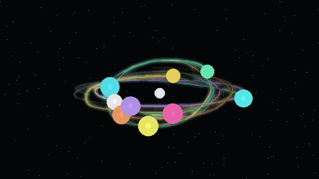

# Orbital Mechanics Art Simulator

A Vite + Three.js generative art playground where seeded N-body systems become glowing orbital drawings.



## Run

```bash
npm install
npm run dev
```

Open the local URL printed by Vite. The default project uses a Web Worker for physics, Three.js for rendering, and a 4K PNG exporter for the current view.

## Scripts

```bash
npm run dev
npm run test
npm run build
npm run preview
```

## Controls

- `Bodies`, `Mass cap`, and `Launch scale` regenerate deterministic initial conditions from the current seed.
- `Gravity`, `Softening radius`, and `Step dt` update the running physics simulation.
- `Trail samples`, `Bloom gain`, and `Palette` update the renderer.
- `Generate` creates a new seeded composition.
- `Export PNG` downloads a 4K PNG named with the seed, palette, body count, gravity, softening, and time step.

## Implementation Notes

- Physics uses softened pairwise gravity and velocity-Verlet integration for stable, art-friendly motion.
- Seeded body generation creates a heavy central attractor with inclined orbital bodies, then removes center-of-mass drift.
- The renderer keeps persistent typed-array trail buffers, additive color, bloom, fog, particle glow, and a procedural starfield.
- Unit tests cover force symmetry, mass effects, softening, deterministic replay, and a stable circular binary orbit.
